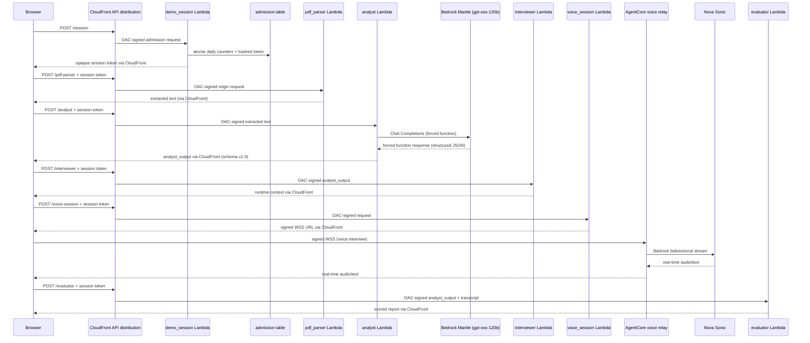
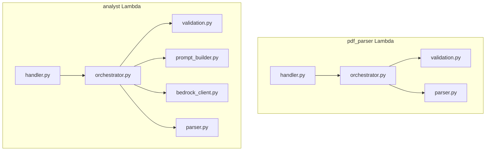

# Design Document: Resume Analysis Pipeline

> Maintained design. Last verified: 2026-08-09. The testing inventory near the end describes current coverage and environment verification separately. Amplify hosting and signed AgentCore WSS are separate hosted boundaries.

## Overview

The Resume Analysis Pipeline consists of two content-stateless AWS Lambda functions that form the intake and analysis stage of the mock interview coaching app:

1. **pdf_parser** — accepts base64-encoded PDFs and plain-text job postings, extracts text using pypdf, and returns the extracted content.
2. **analyst** — receives extracted text (resume + job posting), calls Amazon Bedrock Mantle Chat Completions with a forced function call, validates the response against the analyst_output schema, and returns it to the frontend.

The React browser client orchestrates the pipeline: it calls pdf_parser first, then passes extracted text to the analyst. The hosted client uses one CloudFront API distribution with OAC in front of private Lambda Function URLs (no API Gateway). Local mode sends the same HTTP payloads to `backend.local_server:app`, which invokes the Python handlers directly. Each Lambda retains Function URL and direct-invocation compatibility.

**Key Design Decisions:**
- Content-stateless pipeline — the browser holds interview content and the pipeline does not persist resumes, job descriptions, transcripts, or feedback. Hosted admission uses an expiring DynamoDB table containing only hashed session/viewer identifiers and counters.
- Forced function pattern — the analyst_output schema is supplied as a Chat Completions function and selected through `tool_choice`, producing structured JSON arguments without brittle text parsing.
- Partial success — when processing combined documents, pdf_parser returns results for successful extractions alongside errors for failed ones.
- Environment-aware recovery — hosted uses one 55-second Mantle call and does not make a schema-recovery call; local uses a 120-second transport timeout and makes one additional call only when the first response fails schema validation.

## Architecture

### High-Level System Diagram



The browser never connects directly to Nova or receives long-lived Bedrock credentials. AgentCore runs the Python relay as an AWS-managed serverless container runtime. CDK defines four pipeline Lambdas, the Voice Session Lambda, the Demo Session admission Lambda, the expiring DynamoDB admission table, and the S3 interview-configuration resources; Amplify Hosting and AgentCore are separate infrastructure boundaries.

### Security and Cost Controls

Hosted admission defaults to 100 interviews globally and 100 per trusted viewer IP per UTC day. Its opaque session token authorizes bounded attempts for each downstream stage. Pure local execution bypasses this hosted admission layer.

### Internal Lambda Architecture



## Components and Interfaces

### pdf_parser Lambda

#### handler.py — Entry Point

Detects invocation mode, delegates to orchestrator, formats the response envelope.

```python
def lambda_handler(event: dict, context) -> dict:
    """
    Lambda entry point. Detects Function URL mode vs Direct mode,
    extracts payload, delegates to orchestrator, wraps response.
    
    Returns:
        dict with statusCode and JSON body (for Function URL compatibility)
    """
```

#### orchestrator.py — Business Logic

Coordinates validation and parsing for one or both documents.

```python
def process_documents(payload: dict) -> dict:
    """
    Orchestrates document processing.
    
    Args:
        payload: Validated request payload with optional resume and job_posting fields.
    
    Returns:
        dict with status="success" and data containing extracted text(s),
        or partial results with per-document error entries.
    """
```

#### validation.py — Input Validation

```python
def validate_request(payload: dict) -> tuple[bool, str | None]:
    """
    Validates:
    - At least one document present (resume or job_posting)
    - Decoded PDF size <= 4 MiB (4,194,304 bytes) per document
    - Required fields present for each document type
    - Format flag is valid ("pdf" or "text") for job_posting
    - Plain-text job posting content is no longer than 5,000 characters
    
    Returns:
        (is_valid, error_message_or_none)
    """

def detect_invocation_mode(event: dict) -> dict:
    """
    If event has 'body' key with string value → Function URL mode: parse JSON from event['body'].
    Otherwise → Direct mode: return event as-is.
    
    Returns:
        Extracted payload dict
    """
```

#### parser.py — PDF Text Extraction

```python
def extract_text_from_pdf(base64_content: str) -> str:
    """
    Decodes base64, opens with pypdf.PdfReader, concatenates page text.
    
    Args:
        base64_content: Base64-encoded PDF bytes.
    
    Returns:
        Extracted text string.
    
    Raises:
        ValueError: If base64 cannot be decoded or content is not a valid PDF.
        EmptyDocumentError: If PDF yields zero extractable text.
    """
```

---

### analyst Lambda

#### handler.py — Entry Point

```python
def lambda_handler(event: dict, context) -> dict:
    """
    Lambda entry point. Detects invocation mode, delegates to orchestrator,
    wraps response in standard envelope.
    """
```

#### orchestrator.py — Business Logic Wiring

```python
def analyze(payload: dict) -> dict:
    """
    Orchestrates the analysis pipeline:
    1. Validate inputs
    2. Build prompt
    3. Call Bedrock (one transport attempt)
    4. Parse and validate response
    5. Check for analysis warnings
    
    Returns:
        dict with status="success" and data containing analyst_output,
        or status="error" with descriptive message.
    """
```

#### validation.py — Input Validation

```python
def validate_request(payload: dict) -> tuple[bool, str | None]:
    """
    Validates:
    - resume_text present and non-empty string
    - job_posting_text present, non-empty, and no longer than 5,000 characters in every invocation mode
    
    Returns:
        (is_valid, error_message_or_none)
    """

def detect_invocation_mode(event: dict) -> dict:
    """Same dual-mode detection as pdf_parser."""
```

#### prompt_builder.py — gpt-oss-120b Prompt Construction

```python
MODEL_ID = "openai.gpt-oss-120b"

def build_chat_request(resume_text: str, job_posting_text: str) -> dict:
    """
    Constructs the Bedrock Mantle Chat Completions request with:
    - System prompt (analyst persona, instructions)
    - User message (resume_text + job_posting_text)
    - OpenAI-compatible function definition with the analyst_output schema
    - tool_choice forcing the model to call analyst_output
    
    The tool definition's inputSchema mirrors schemas/analyst_output.json.
    This forces gpt-oss-120b to produce structured JSON matching the schema.
    
    Returns:
        dict ready to pass to bedrock_client.call_chat_completion(request)
    """
```

#### bedrock_client.py — Bedrock Mantle Chat Completions Call

```python
REGION = "us-east-1"
MAX_ATTEMPTS = 1

def call_chat_completion(request: dict) -> dict:
    """
    Signs and calls Bedrock Mantle with a bounded transport-attempt limit.
    
    Transport failures are surfaced after one attempt. The orchestrator owns
    the only retry: one fresh call after schema-invalid model output.
    
    Args:
        request: Chat Completions request dict from prompt_builder.
    
    Returns:
        Raw Chat Completions response dict.
    
    Raises:
        BedrockCallFailed: After MAX_ATTEMPTS failures, with reason.
    """
```

#### parser.py — Response Parsing and Validation

```python
def parse_chat_response(response: dict) -> dict:
    """
    Extracts the analyst_output function arguments from the Chat Completions response.
    Validates the extracted JSON against the analyst_output schema structure.
    
    Validation checks:
    - All top-level keys present
    - schema_version == "1.0"
    - experience_type values in allowed set
    - relevance_score in [0.0, 1.0]
    - interview_plan has max 5 entries
    
    Returns:
        Validated analyst_output dict.
    
    Raises:
        SchemaValidationError: If response doesn't conform to schema.
    """

def check_analysis_warnings(analyst_output: dict, resume_text: str, job_posting_text: str) -> list[str]:
    """
    Checks for data quality issues and returns warnings list:
    - resume_text < 50 words → "Insufficient resume content"
    - job_posting_text < 30 words → "Insufficient job posting content"
    - len(selected_experiences) == 0 → "Low alignment between resume and job posting"
    
    Returns:
        List of warning strings (empty if none).
    """
```

---

### Shared Patterns

Both Lambdas share the same response envelope and invocation-mode detection:

```python
# Response envelope (success)
{"status": "success", "data": {...}}

# Response envelope (error)
{"status": "error", "error": "descriptive message"}
```

The pipeline handlers retain their own invocation-envelope logic. Hosted authorization is shared through the Lambda layer in `backend/functions/shared/python/session_guard.py`, which validates the expiring session token, viewer binding, and per-stage claim before paid work begins.

## Data Models

### pdf_parser Request Payload

```json
{
  "session_token": "<opaque interview session token>",
  "resume": {
    "content": "<base64-encoded PDF>",
    "format": "pdf"
  },
  "job_posting": {
    "content": "<base64-encoded PDF or plain text>",
    "format": "pdf" | "text"
  }
}
```

Either `resume` or `job_posting` (or both) must be present. The `format` field on `job_posting` is the Format_Flag. For `resume`, format is always `"pdf"` (implicit, not required in payload).

### pdf_parser Success Response

```json
{
  "status": "success",
  "data": {
    "resume_text": "extracted resume text...",
    "job_posting_text": "extracted or passed-through job posting text..."
  }
}
```

Fields are only present for documents that were provided in the request.

### pdf_parser Partial Success Response

When one document succeeds and another fails in a combined request:

```json
{
  "status": "success",
  "data": {
    "resume_text": "extracted text...",
    "job_posting_error": "No text could be extracted from the document"
  }
}
```

### pdf_parser Error Response

```json
{
  "status": "error",
  "error": "Descriptive error message"
}
```

### analyst Request Payload

```json
{
  "session_token": "<opaque interview session token>",
  "resume_text": "full extracted resume text",
  "job_posting_text": "full extracted job posting text"
}
```

### analyst Success Response

```json
{
  "status": "success",
  "data": {
    "schema_version": "1.0",
    "candidate_profile": {...},
    "target_role": {...},
    "resume_job_alignment": {...},
    "interview_plan": [...],
    "selected_experiences": [...],
    "analysis_warnings": [...]
  }
}
```

The `data` field contains the full analyst_output conforming to `schemas/analyst_output.json`.

### analyst Error Response

```json
{
  "status": "error",
  "error": "Descriptive error message"
}
```

### Bedrock Mantle Chat Completions Request Structure (analyst)

```python
{
    "model": "openai.gpt-oss-120b",
    "messages": [
        {"role": "system", "content": "<analyst persona and instructions>"},
        {
            "role": "user",
            "content": "<resume_text + job_posting_text>"
        }
    ],
    "tools": [
        {
            "type": "function",
            "function": {
                "name": "analyst_output",
                "description": "Produce a structured resume analysis",
                "parameters": {
                    "type": "object",
                    "properties": {...},
                    "required": [...]
                }
            }
        }
    ],
    "tool_choice": {"type": "function", "function": {"name": "analyst_output"}},
    "max_tokens": 4096,  // hosted; pure local mode retains 8192
    "temperature": 0.0,
    "reasoning_effort": "low"
}
```

The `tool_choice` field forces the model to call `analyst_output`. Its `parameters` mirror `schemas/analyst_output.json` as JSON Schema.

### Chat Completions Response Parsing

The response contains:
```python
arguments = response["choices"][0]["message"]["tool_calls"][0]["function"]["arguments"]
analyst_output = json.loads(arguments)
```

### Key Constants

| Constant | Value | Location |
|----------|-------|----------|
| REGION | `"us-east-1"` | `bedrock_client.py` |
| MODEL_ID | `"openai.gpt-oss-120b"` | `prompt_builder.py` |
| MAX_ATTEMPTS | `1` | `bedrock_client.py` |
| MAX_PDF_SIZE_BYTES | `4_194_304` (4 MiB) | `validation.py` (pdf_parser) |
| MIN_RESUME_WORDS | `50` | `parser.py` (analyst) |
| MIN_JOB_POSTING_WORDS | `30` | `parser.py` (analyst) |
| SCHEMA_VERSION | `"1.0"` | `parser.py` (analyst) |
| ALLOWED_EXPERIENCE_TYPES | `["internship", "coursework", "academic_project", "personal_project", "hackathon", "student_club", "research", "volunteering", "work_experience", "other"]` | `parser.py` (analyst) |


## Correctness Properties

*A property is a characteristic or behavior that should hold true across all valid executions of a system — essentially, a formal statement about what the system should do. Properties serve as the bridge between human-readable specifications and machine-verifiable correctness guarantees.*

### Property 1: PDF Text Extraction Round-Trip

*For any* text content written into a valid PDF document, base64-encoding that PDF and passing it through `extract_text_from_pdf` SHALL return a string that contains the original text content (modulo whitespace normalization).

**Validates: Requirements 1.1, 2.1, 3.1**

### Property 2: Plain Text Pass-Through Identity

*For any* arbitrary text string provided with `format="text"` as a job posting, the pdf_parser SHALL return that exact string as the `job_posting_text` without modification.

**Validates: Requirements 2.2**

### Property 3: Invalid PDF Rejection

*For any* base64-encoded byte sequence that is NOT a valid PDF, the pdf_parser SHALL return an error response (never a success with garbled text).

**Validates: Requirements 1.3**

### Property 4: Invalid Format Flag Rejection

*For any* string value of Format_Flag that is not `"pdf"` or `"text"`, the pdf_parser SHALL return an error response indicating an invalid format flag.

**Validates: Requirements 2.3**

### Property 5: Invocation Mode Equivalence

*For any* valid request payload `P`, invoking the Lambda with `{"body": json.dumps(P)}` (Function URL mode) SHALL produce the same processing result as invoking with `P` directly (Direct mode). This applies to both pdf_parser and analyst.

**Validates: Requirements 4.4, 4.5, 8.3, 8.4, 11.1, 11.2, 11.3, 11.4**

### Property 6: pdf_parser Validation Rejects Malformed Requests

*For any* request payload that (a) contains neither `resume` nor `job_posting`, (b) has a PDF document exceeding 4 MiB (4,194,304 bytes), or (c) is missing required sub-fields for a declared document, the pdf_parser SHALL return an error response and never attempt PDF processing.

**Validates: Requirements 4.1, 4.2, 4.3**

### Property 7: Analyst Validation Rejects Missing or Empty Text

*For any* request payload where `resume_text` or `job_posting_text` is missing, null, or an empty string, the analyst SHALL return an error response listing the specific invalid fields, and SHALL NOT call the Bedrock API.

**Validates: Requirements 8.1, 8.2**

### Property 8: Schema Validator Rejects Non-Conforming Output

*For any* dict that is missing required top-level keys, has `schema_version` != "1.0", contains a missing or non-string `experience_type`, has a `relevance_score` outside [0.0, 1.0], or has more than 5 entries in `interview_plan`, the schema validator SHALL raise a validation error. Known experience-type aliases SHALL map to canonical values, and unfamiliar non-empty strings SHALL map to `other`.

**Validates: Requirements 5.5, 5.6, 6.1, 6.2, 6.3**

### Property 9: Bedrock Call Budget Is Bounded

*For any* transport/API failure, the Bedrock client SHALL surface the failure after its single configured attempt. If a successful response fails schema validation, the orchestrator SHALL make exactly one fresh recovery call (maximum two Bedrock calls total).

**Validates: Requirements 6.5, 9.1, 9.3**

### Property 10: Analysis Warnings Reflect Data Quality Conditions

*For any* combination of `resume_text`, `job_posting_text`, and `selected_experiences`:
- A "insufficient resume content" warning is present if and only if `resume_text` has fewer than 50 words.
- A "insufficient job posting content" warning is present if and only if `job_posting_text` has fewer than 30 words.
- A "low alignment" warning is present if and only if `selected_experiences` is empty.
- When none of these conditions hold, the warnings list is empty.

**Validates: Requirements 10.1, 10.2, 10.3, 10.4**

### Property 11: Response Envelope Consistency

*For any* invocation of either Lambda (pdf_parser or analyst), the response SHALL be a JSON object with exactly one of: `{"status": "success", "data": ...}` or `{"status": "error", "error": ...}`. No other envelope structures are permitted.

**Validates: Requirements 12.1, 12.2, 12.3, 12.4**

### Property 12: Partial Success on Combined Documents

*For any* combined request where one document is valid and the other is invalid, the pdf_parser SHALL return `status="success"` with extracted text for the valid document AND an error entry for the invalid document (never a full error response, never dropping the valid result).

**Validates: Requirements 3.4**

## Error Handling

### pdf_parser Error Handling

Validation failures use the error envelope/status indicators below. Extraction failures are different in the current implementation: the orchestrator records `resume_error` or `job_posting_error`, and the handler returns HTTP 200 with a success envelope. That behavior also occurs for a single failed document and does not yet satisfy the maintained requirements.

| Error Condition | Response | Status Indicator |
|---|---|---|
| Invalid base64 encoding | `{"status": "error", "error": "Failed to decode base64 content for <doc_type>: <detail>"}` | 400 |
| Not a valid PDF | `{"status": "error", "error": "Content is not a valid PDF document"}` | 400 |
| Zero extractable text | `{"status": "error", "error": "No text could be extracted from the document"}` | 400 |
| Missing both documents | `{"status": "error", "error": "Request must contain at least one document (resume or job_posting)"}` | 400 |
| Document exceeds 4 MB | `{"status": "error", "error": "<doc_type> exceeds the 4 MB size limit"}` | 400 |
| Missing required fields | `{"status": "error", "error": "Missing required fields: <field_list>"}` | 400 |
| Invalid format flag | `{"status": "error", "error": "Invalid format flag: '<value>'. Must be 'pdf' or 'text'"}` | 400 |
| Malformed JSON in event['body'] | `{"status": "error", "error": "Failed to parse request body as JSON"}` | 400 |
| Unexpected exception | `{"status": "error", "error": "Internal error: <brief description>"}` | 500 |

**Partial Success Pattern**: When processing combined documents and one fails, the response is `status="success"` with the valid document's text in `data` alongside an error key for the failed document (e.g., `"job_posting_error": "..."`). This avoids losing the successful extraction.

### analyst Error Handling

| Error Condition | Response | Status Indicator |
|---|---|---|
| Missing/empty resume_text | `{"status": "error", "error": "Missing or empty fields: resume_text"}` | 400 |
| Missing/empty job_posting_text | `{"status": "error", "error": "Missing or empty fields: job_posting_text"}` | 400 |
| Both fields missing/empty | `{"status": "error", "error": "Missing or empty fields: resume_text, job_posting_text"}` | 400 |
| Malformed JSON in event['body'] | `{"status": "error", "error": "Failed to parse request body as JSON"}` | 400 |
| Bedrock transient failure | `{"status": "error", "error": "Bedrock service error: Bedrock Mantle call failed after 1 attempt: <reason>"}` | 502 |
| Bedrock response not parseable after the allowed local recovery, or on the single hosted call | `{"status": "error", "error": "Response validation error: <parser detail>"}` | 502 |
| Schema validation failure after the allowed local recovery, or on the single hosted call | `{"status": "error", "error": "Response validation error: <schema detail>"}` | 502 |
| Unexpected exception | `{"status": "error", "error": "Internal error: <brief description>"}` | 500 |

### Retry Strategy (analyst)

```text
local orchestrator attempt 1
  └─ bedrock_client: 1 transport attempt
  └─ parse and validate
if local schema validation fails:
  orchestrator attempt 2
    └─ bedrock_client: 1 fresh transport attempt
    └─ parse and validate
```

`ReadTimeoutError`, throttling, and Bedrock 5xx responses are surfaced immediately by the client. Local schema-invalid output receives one recovery call, for at most two service calls; hosted schema-invalid output is returned after its single call.

## Testing Strategy: Current and Planned

### Current Coverage

- `backend/functions/pdf_parser/tests/test_validation.py` covers the ten validation and invocation-mode cases migrated from the original standalone check script.
- `tests/integration/test_pipeline.py` runs a mocked Analyst → Interviewer → Evaluator contract flow in isolated subprocesses.
- Analyst operational tests cover the Bedrock timeout/retry configuration, gpt-oss-120b model, the hosted 4,096/local 8,192-token budgets, hosted input caps, and one schema-recovery call.
- Evaluator and Interviewer have their own unit suites under their function directories.
- There is currently no PDF extraction/orchestrator suite, Hypothesis suite, or real-AWS integration suite.

The sections below are the planned expansion, not a description of tests that already exist.

### Planned Property-Based Testing

Property-based testing (PBT) is appropriate for this feature because:
- The pdf_parser has pure functions with clear input/output (base64 → text, validation → bool)
- The analyst has deterministic validation logic (schema validation, warning generation)
- The input space is large (arbitrary PDFs, arbitrary text strings, arbitrary JSON payloads)
- Universal properties hold across all valid inputs

**Library**: [Hypothesis](https://hypothesis.readthedocs.io/) (Python's standard PBT library)

**Configuration**: Each property test runs a minimum of 100 iterations.

**Tag format**: Each test is annotated with:
```python
# Feature: resume-analysis-pipeline, Property N: <property text>
```

**Property test targets** (from Correctness Properties above):

| Property | Module Under Test | Key Generators |
|---|---|---|
| 1: PDF Round-Trip | `backend/functions/pdf_parser/parser.py` | Generate text → build PDF with pypdf → base64 encode |
| 2: Text Pass-Through | `backend/functions/pdf_parser/orchestrator.py` | `st.text()` |
| 3: Invalid PDF Rejection | `backend/functions/pdf_parser/parser.py` | `st.binary()` base64-encoded (non-PDF) |
| 4: Invalid Format Flag | `backend/functions/pdf_parser/validation.py` | `st.text().filter(lambda s: s not in ("pdf", "text"))` |
| 5: Invocation Mode Equivalence | `*/handler.py` | Any valid payload wrapped/unwrapped |
| 6: pdf_parser Validation | `backend/functions/pdf_parser/validation.py` | Payloads with missing/oversized fields |
| 7: Analyst Validation | `backend/functions/analyst/validation.py` | Payloads with missing/empty text fields |
| 8: Schema Validator | `backend/functions/analyst/parser.py` | Dicts with random mutations (remove keys, bad values) |
| 9: Call Budget | `backend/functions/analyst/bedrock_client.py`, `backend/functions/analyst/orchestrator.py` | Mock transport and schema-validation failures |
| 10: Analysis Warnings | `backend/functions/analyst/parser.py` | Strings of varying word counts, lists of varying length |
| 11: Response Envelope | `*/handler.py` | Any inputs (valid and invalid) |
| 12: Partial Success | `backend/functions/pdf_parser/orchestrator.py` | One valid + one invalid document |

### Planned Unit Tests (Example-Based)

Unit tests complement property tests for specific scenarios:

- **pdf_parser**:
  - Resume-only request → success with only `resume_text`
  - Job-posting-only request → success with only `job_posting_text`
  - Empty PDF (image-only) → appropriate error
  - Direct mode invocation (no `body` key) → payload used directly

- **analyst**:
  - Successful end-to-end with mocked Bedrock (golden path)
  - Bedrock transport/API failure → 502 error response after one client attempt
  - First schema-invalid response, second valid response → success returned
  - Direct mode invocation

### Planned External Integration Tests

Integration tests verify the full pipeline against real services:

- pdf_parser: Upload a real resume PDF, verify extracted text is reasonable
- analyst: Send real extracted text to Bedrock, verify schema-conformant output
- End-to-end: pdf_parser → analyst with a real resume + job posting

These run with 1–3 representative inputs (not PBT) due to cost and external dependencies.

### Planned Test File Organization

```
backend/functions/
  pdf_parser/tests/
    test_parser_properties.py      # Property tests (Hypothesis)
    test_validation_properties.py  # Property tests
    test_handler.py                # Unit + invocation mode tests
    test_orchestrator.py           # Unit tests
  analyst/tests/
    test_parser_properties.py      # Property tests (schema validation, warnings)
    test_validation_properties.py  # Property tests
    test_bedrock_client.py         # Retry property tests (mocked)
    test_handler.py                # Unit + invocation mode tests
    test_orchestrator.py           # Unit tests (mocked Bedrock)
tests/
  integration/
    test_pdf_parser_e2e.py
    test_analyst_e2e.py
    test_pipeline_e2e.py
```
